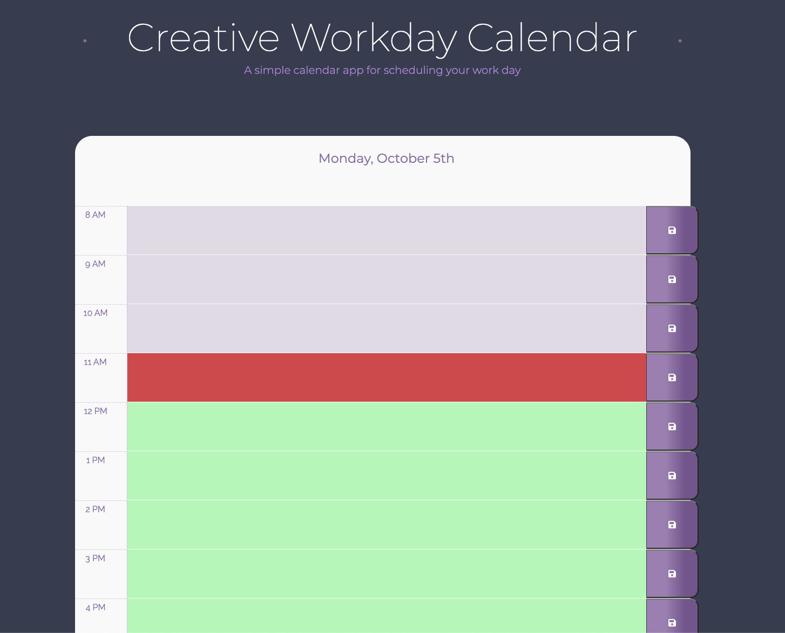

# Creative Workday Calendar
## A workday calendar for tasks during the workday

This directory contains a workday calendar meant to help a user create a workday task record. The folder contains a JS file, HTML, and CSS file. The calendar shows the current day and the workday hours. It colors the hours based on hours already past, the current hour, and hours still in the future. The user can type in tasks and hit save. The tasks are saved in localStorage and a user can come back and see them at any time upon reloading the page or opening the page again.  

The Caledar Code can be seen here: [portfolio](https://github.com/pmhagwood/workdayscheduler)
The live calendar is here: [livesite](https://pmhagwood.github.io/workdayscheduler/)

